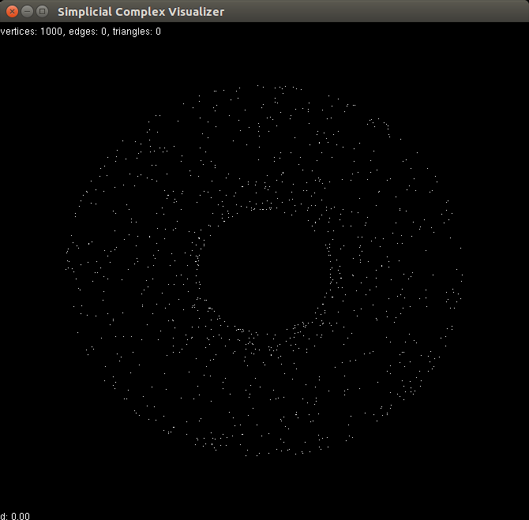
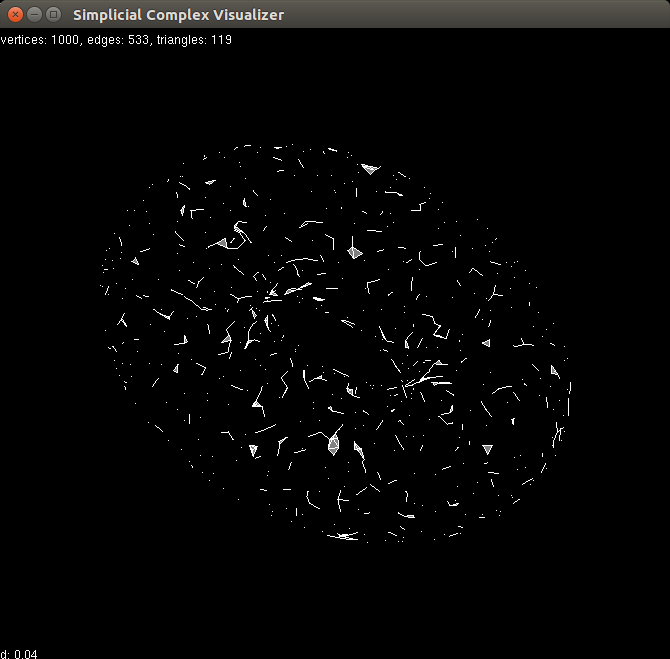
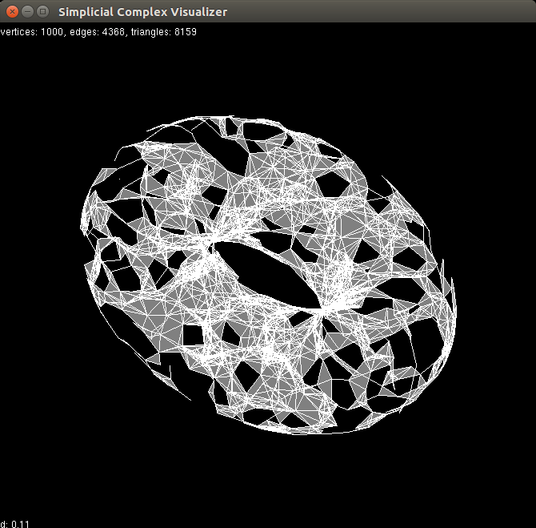

### Description

Visualize the construction of Vietoris-Rips complex on a set of 3d
points.

### How to Build

Install stack: https://docs.haskellstack.org/en/stable/README/

Install OpenGL and GLUT dev packages on your system.

Build: `stack build`

Run: `stack exec gui`

### How to Use

Click and drag to rotate the model.

Press the right and left arrow keys to increase and decrease,
respectively, the distance threshold. The current threshold value is
displayed in the lower lefthand corner.

### Screenshots

